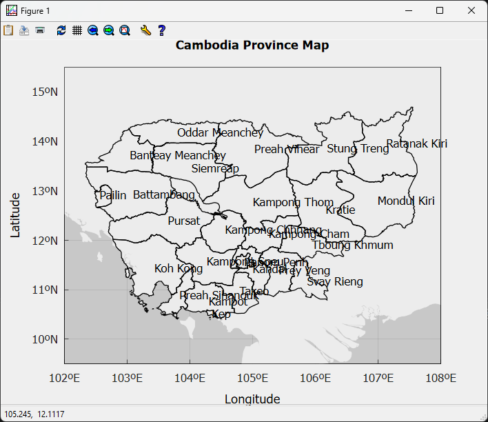

# Cambodia Province Map

A C++17 project that visualizes Cambodia's provincial boundaries using **Matplot++**, **GeoJSON**, **nlohmann/json**, and **xmake**.

## Preview

<p align="center">
  
</p>

## Features

- Render 25 Cambodia provinces from GeoJSON
- Support for Polygon and MultiPolygon
- Automatic province name detection
- Centroid-based label placement
- Longitude / Latitude axes and grid

## Tech Stack

| Technology    | Purpose                  |
|---------------|--------------------------|
| C++17         | Language                 |
| Matplot++     | Visualization            |
| nlohmann/json | GeoJSON parsing          |
| xmake         | Build system             |
| GNUplot       | Rendering backend        |

## Project Structure

```
cambodia-province-map/
├── src/
│   └── main.cpp
├── data/
│   └── CambodiaProvinceBoundaries.geojson
├── xmake.lua
└── README.md
```

## Requirements

- C++17 compiler
- xmake
- Matplot++
- nlohmann/json
- GNUplot

## Installation

```bash
git clone https://github.com/DorkMeas/cambodia-province-map.git
cd cambodia-province-map

xrepo install nlohmann_json
xrepo install matplotplusplus
```

## Build & Run

```bash
xmake f -p windows -a x64
xmake
xmake run
```

## Data

- File: `data/CambodiaProvinceBoundaries.geojson`
- Format: GeoJSON (EPSG:4326)
- Source: [Data for Economic and Finance Open Data Portal](https://data.mef.gov.kh/datasets/pd_66c2f42249eb6c00013c1383)

## Author

**Dork Meas**  
GitHub: [DorkMeas](https://github.com/DorkMeas)
